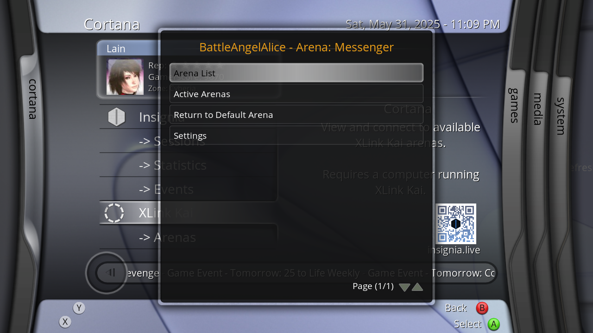

# XLink Revived - XLink Kai script for XBMC4Xbox

## Working
- Displaying username + current Arena
- Querying and joining Arenas (via "Arenas List" and "Active Arenas")
- Setting the Arena back to the default Arena!
- Viewing XLink Kai statistics
- sys.argv support for skin integration [ie; calling RunScript(Q:/scripts/XLink/default.py,ActiveArenas) will automatically launch the Active Arenas subcategory

## Not Working
- Showing additional user information
- Editing settings of any kind

## TODO
- Integrate into Cortana Server Browser

# Credits
- SolAZDev - Original "xbmc-kai" script that this uses initialization code from.
- CrunchBite - For working on XLink Kai, providing accessible REST API requests, and chatting with me about how certain systems work! :)
- Milenko - For all the discussions about different methods of XLink integration we've had!
