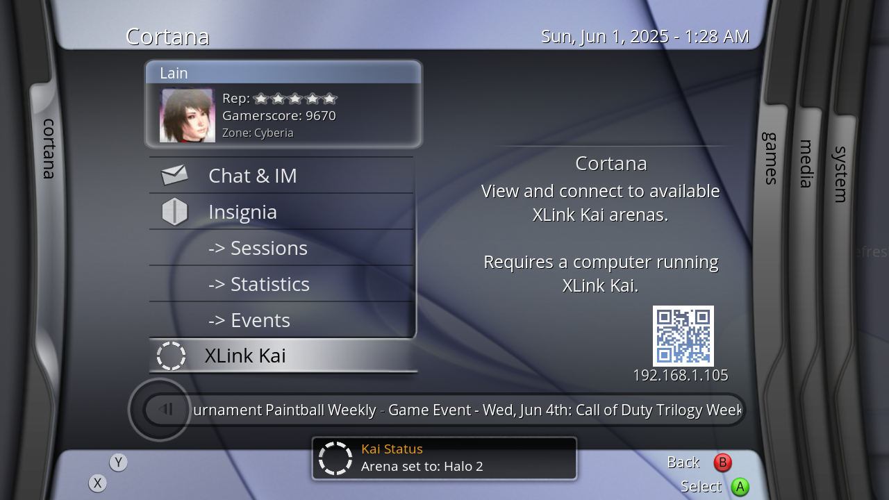

# XLink Revived - XLink Kai script for XBMC4Xbox




## Installation:
- Download the latest release .zip
- Copy the "script.xlinkRevived" folder to "Q:/scripts/"
- Launch XLink Kai on your host machine, then launch the XLink Revived script and watch as it connects automagically! If this fails, you can enter your Kai IP address manually in the add-on settings (as well as your XLink Kai username + password if auto-login isn't enabled)
- (For the best user experience, pair this script with [Cortana Server Browser](https://github.com/faithvoid/script.cortanaserverbrowser) so you can view current session information including playercounts!)

## FAQ:
- "My XLink system isn't detected?"

Make sure that XLink Kai is running, has "Allow remote UI connections" enabled in the settings (usually on by default), and that UDP/TCP ports 34522 are allowed in your firewall settings.

- "I downloaded it from the repository instead of the release .zip and it doesn't work?"

That's why there's a release zip. Changes made directly to the repository are experimental, you're on your own if you run the repo builds.

- "Will you integrate *XYZ feature?*"

If Team XLink supports it in their API, sure! Otherwise, there's only so much I can do.

- "I've figured out how to do *XYZ feature*, can I add a pull request to integrate it?"

Please do! This should be a community effort that brings players together. Any and all assistance on this project is much appreciated!

## TODO:
- [X] Integrate Kai UI attacher script
- [X] Integrate chat services (arena chat works, PM support doesn't)
- [X] Fix notifier disconnection when sending a new arena state via HTTPS. 
- [] Fix this TODO list

## Working
- Auto-discovering XLink Kai hosts when an IP address isn't provided (UI client + Notifier)
- Displaying username + current Arena (UI client)
- Querying and joining Arenas (via "Arenas List" and "Active Arenas") (UI client)
- Querying and joining sub-Arenas (via "Arenas List") (UI client)
- Setting the Arena back to the default Arena! (General Chat) in the UI client
- Sending chat messages to players in the current arena in the UI client
- Receiving notifications for players joining/leaving/chatting in your current Arena via the notifier! (Notifier)
- View chat history via the XLink Revived UI client, making sure you never miss an important message! (UI client + Notifier)
- Viewing XLink Kai statistics (UI client)
- sys.argv support for skin integration (ie; calling ```RunScript('script.xlinkRevived',Chat)``` to call the Chat submenu)

## Not Working
- Joining sub-Arenas from Active Arenas (as it's not implemented in the GetActiveGames API, only in GetGamesList)
- Showing additional user information
- Editing settings of any kind

## Bugs:
- Joining an arena via the "XLink Revived" UI will kill the notifier. There seems to be an engine-specific issue that treats HTTP arena connections as a new engine takeover, so these sections might have to be rebuilt.
- Notifier script is a bit heavy on stock 64MB systems, I'd highly recommend running XBMC in 480p to use as little RAM as possible on stock systems.

## TODO
- Finish adding additional chat features (figured out how to send PMs, Arena PMs & chat messages, but haven't figured out how to receive them, or receive player information).
- Finish implementing login feature for users not using auto-login (you really should use auto-login though).
- Integrate into Cortana Server Browser
- Better custom notification icon support for non-Cortana users.

## Developer Info:
### InfoLabels for Skin Development
- xlinkConnectedIP - IP address of the currently connected XLink Kai machine. ``` 192.168.1.1 ``` 
- xlinkConnected - The status of the connection between XLink Revived and Kai Engine  (```Online``` and ```Offline```)
- xlinkActiveUser - Curently logged in XLink Kai user ```faithvoid```
- xlinkActiveUserAvatar - Fetches and displays the logged in XLink Kai user's avatar via HTTP ```https://cdn.teamxlink.co.uk/media/useravatars/50/9/b19b3a630f19813f720c4d655b0b903f_50.jpg```
- xlinkActiveArena - Current connected XLink Kai arena ```Halo 2```
- xlinkArenaAvatar - Fetches and displays the image of the current arena via HTTP 
- xlinkChatPending - User has a pending (arena/messenger) chat message. (```True``` or ```False```)
- xlinkChatLastMessage - Display the last received XLink Kai arena/messenger chat message.
- xlinkPMLastMessage - Display the last received XLink Kai Private Message.
- xlinkMessagePending - User has a pending Private Message. (```True``` or ```False```)
- xlinkFriendPending - User has a pending Friend Request. (```True``` or ```False```)
- xlinkVectorType - Dispaly whether the user is connected to an Arena or a Messenger vector (states are 'Arena' and 'Messenger')
- xlinkArenaUsers - Display total Arena user count ```25```
- xlinkFriends - Display total friend count ```10```
- xlinkFriendsOnline - Display currently online friend count ```5```

# Credits
- SolAZDev - Original "xbmc-kai" script that this uses initialization code from.
- CrunchBite - For working on XLink Kai, providing accessible REST API requests, and chatting with me about how certain systems work! :)
- Milenko - For all the discussions about different methods of XLink integration we've had!
