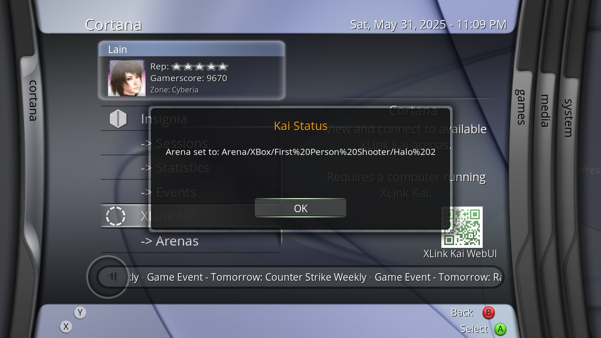

# XLink Revived - XLink Kai script for XBMC4Xbox

## Working
- Joining arenas (not querying them, so all arenas have to be entered manually into either vectors.txt or faves.txt!)
- Joining favourite arenas for quick access to arenas you regularly play! (requires an entry in faves.txt)
- Setting your default Arena to the default "Arena" after a match!
- Viewing XLink Kai statistics

## Not Working
- Querying arenas (the API doesn't seem to support this, so all joining has to be done manually!)
- Showing additional user information
- Editing settings of any kind

## TODO
- Query arenas and sub-arenas whenever that functionality becomes available (talked to CrunchBite about adding sub-arena API calls & he's willing to work on it!)
- Show currently logged in user as script title? (ie; "XLink Kai - BattleAngelAlice")?
- Integrate into Cortana Server Browser
- Rename all public-facing entries of the word "Vectors" to "Arenas" for clarity (as they're referred to as Vectors behind the scenes, but Arenas in UI)

# Credits
- SolAZDev - Original "xbmc-kai" script that this uses initialization code from.
- CrunchBite - For working on XLink Kai, providing accessible REST API requests, and chatting with me about how certain systems work! :)
