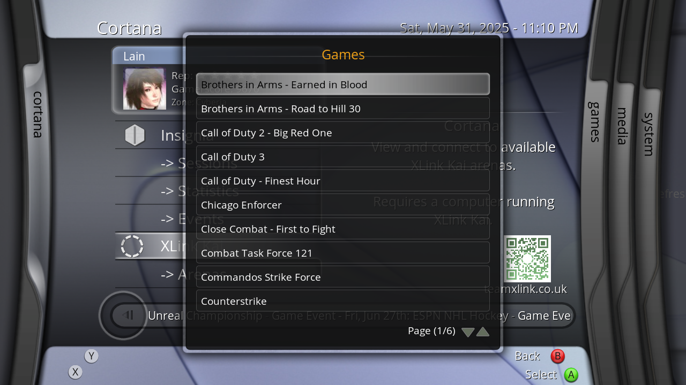

# XLink Revived - XLink Kai script for XBMC4Xbox

## Installation:
- Copy "default.py" & "default.tbn" to "Q:/scripts/XLinkRevived/default.py"
- Launch XLink Kai on your host machine, then launch the XLink Revived script and watch as it connects automagically!
- (For the best user experience, pair this script with [Cortana Server Browser](https://github.com/faithvoid/script.cortanaserverbrowser) so you can view current session information including playercounts!)

## FAQ:
- "My XLink system isn't detected?"
Make sure that XLink Kai is running, has "Allow remote UI connections" enabled in the settings (usually on by default), and that UDP/TCP ports 34522 are allowed in your firewall settings.

## Working
- Displaying username + current Arena
- Querying and joining Arenas (via "Arenas List" and "Active Arenas")
- Querying and joining sub-Arenas (via "Arenas List")
- Setting the Arena back to the default Arena!
- Viewing XLink Kai statistics
- sys.argv support for skin integration [ie; calling RunScript(Q:/scripts/XLink/default.py,ActiveArenas) will automatically launch the Active Arenas subcategory

## Not Working
- Joining sub-Arenas from Active Arenas (as it's not implemented in the GetActiveGames API, only in GetGamesList)
- Showing additional user information
- Editing settings of any kind
- Any sort of social feature (ie; friends, chatting)

## Bugs:
- Toast notification icons will end up being blank for most users. A workaround is to add an "icon-xlinkkai.png" file to your skin, or modify the lines in default.py that say "icon-xlinkkai.png" to point to the icon of your choice.

## TODO
- Integrate into Cortana Server Browser
- Better custom notification icon support for non-Cortana users.

# Credits
- SolAZDev - Original "xbmc-kai" script that this uses initialization code from.
- CrunchBite - For working on XLink Kai, providing accessible REST API requests, and chatting with me about how certain systems work! :)
- Milenko - For all the discussions about different methods of XLink integration we've had!
